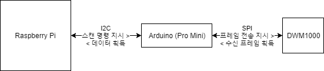
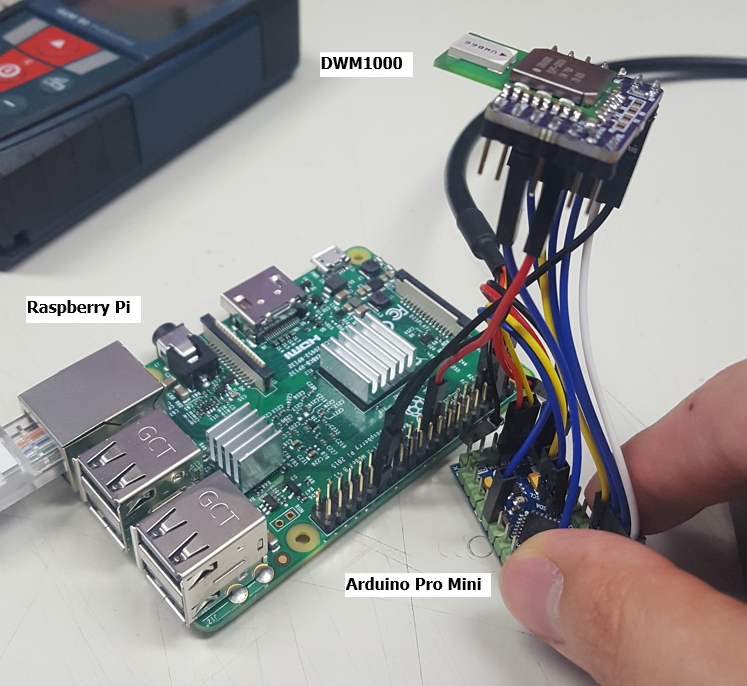
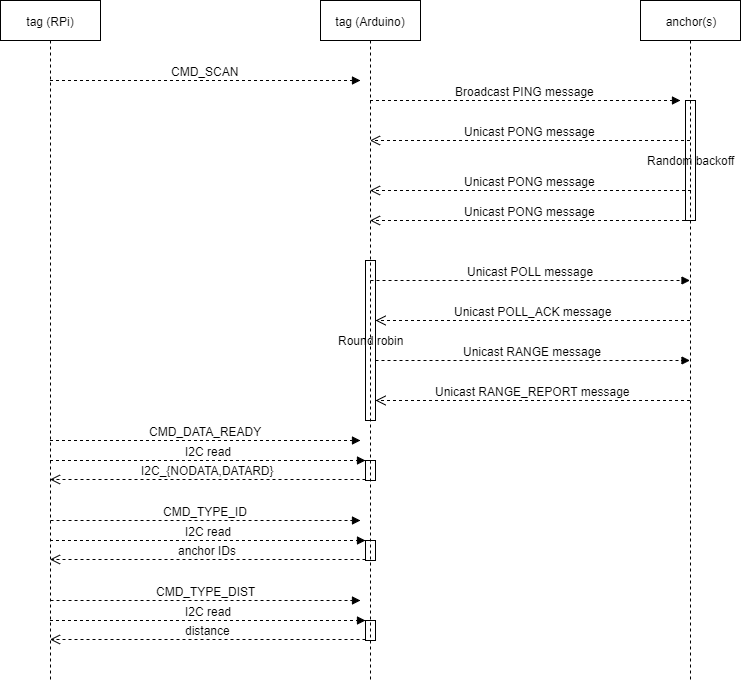

# DW1000 측위 모듈 - 태그

## 시스템 개요



## 하드웨어

- Raspberry Pi
- Arduino Pro Mini (atmega 328, 3.3 V, 8 MHz)
- DWM1000

### 하드웨어 연결

- Arduino와 DWM1000에 3.3 V 전원을 공급합니다 (Raspberry Pi와 접지를 공유하도록 연결)
- Raspberry Pi와 Arduino의 `SDA`, `SCL` 핀을 연결합니다
- Arduino와 DWM1000
    - SPI `CLK` (`SCK`), `MOSI`, `MISO`, `SS` (`CS`, `CE`) 핀을 연결합니다
    - Arduino의 2번 핀과 DWM1000의 `IRQ` 핀을 연결합니다
    - Arduino의 9번 핀과 DWM1000의 `RST` 핀을 연결합니다



## 예제 소프트웨어

- `tagRPi/`: Raspberry Pi의 Linux 상에서 구동되는 측위 예제 프로그램입니다
- `tagArduino/`: Arduino Pro Mini 상에서 구동되는 측위 예제 스케치입니다

### 소프트웨어 빌드 및 설치

#### `tagRPi`

**Ubuntu Linux를 기준으로 설명하겠습니다.
I2C 제어와 Eigen3 라이브러리는 Windows에서도 사용가능하나
그 (설치) 방법은 여기에서 다루지 않았습니다**

##### 사전 요구사항

I2C 제어를 위한 `libi2c-dev`를 설치합니다

```sh
[sudo] apt-get install libi2c-dev
```

삼변측량을 위한 Eigen3를 설치하고, `mlat`을 다운로드합니다

```sh
[sudo] apt-get install libeigen3-dev
git clone https://github.com/gsongsong/mlat
```

##### 소프트웨어 빌드

- 상위 폴더에서 `def.h`, `i2c.h`를 복사합니다
- 필요한 경우, `i2c.h` 파일 안의 `I2CSLAVEADDR`를 수정합니다  
   이것은 Raspberry Pi에 I2C로 연결된 Arduino slave의 주소를 의미합니다
- `Makfile` 파일 안의 `MLAT`을 위에서 다운로드한 mlat의 `cpp` 디렉토리를 가르키도록 수정합니다
- `i2cController.h`의 `I2CDEV`를 Ubuntu Linux 상의 올바른 I2C 장치 파일을 가르키도록 수정합니다

아래 명령을 입력하여 소프트웨어를 빌드하고 실행하여 결과를 확인합니다
```sh
make
./tagRPi
```

#### `tagArduino`

##### 사전 요구사항

Arduino 스케치를 컴파일하고 업로드할 컴퓨터에 [`arduino-dw1000`](https://github.com/thotro/arduino-dw1000)를 설치합니다. 해당 페이지의 Installation 섹션을 참고하십시오

##### 스케치 업로드

- 상위 폴더에서 `def.h`, `dwm1000.h`, `i2c.h`를 복사합니다
- 필요한 경우, `i2c.h` 파일 안의 `I2CSLAVEADDR`를 수정합니다  
   이것은 Raspberry Pi에 I2C로 연결된 Arduino slave의 주소를 의미합니다

Arduino IDE를 사용하여 스케치를 컴파일하고 업로드합니다

## 소프트웨어 메커니즘

### I2C 통신 메커니즘

- Raspberry Pi와 Arduino는 I2C 인터페이스를 통해 명령과 데이터를 주고 받습니다
- Arduino는 기본적으로 `I2CSLAVEADDR (0x04)`의 주소를 사용하여 slave로 작동합니다
- 스캔
   - Raspberry Pi가 Arduino에게 스캔 명령을 전송하면, Arduino는 최대 5 개의 주변 앵커(비콘)을 스캔하고 각 앵커와의 거리를 측정합니다
   - Raspberry Pi가 Arduino에게 I2C 연결을 통해 `CMD_SCAN (0x01)` 1 바이트를 전송하는 것으로 스캔 명령이 전송됩니다
- 데이터 준비 확인
   - Raspberry Pi가 Arduino에게 I2C 연결을 통해 `CMD_DATA_READY (0x02)` 1 바이트를 전송하는 것으로, 거리 측정 데이터가 준비되었지 확인할 수 있는 특정한 값을 전송하도록 준비시킵니다
   - Raspberry Pi가 Arduino로부터 1 바이트를 읽었을 때, 읽은 값이
      - `I2C_NODATA`, `123` 또는 2진수로 `01111011`일 경우 잠시 후에 다시 시도하십시오
      - `I2C_DATARD`, `131` 또는 2진수로 `10000011`일 경우 Arduino가 거리 측정 데이터를 전송할 준비가 되었다는 것을 알 수 있습니다
   - **스캔 명령을 전송한 후, 250 ms 이후에 데이터가 준비됩니다. 충분한 공백을 두어 330 ms 이후 데이터를 획득하는 것을 권장합니다**
- 앵커(비콘) ID 획득
   - Raspberry Pi가 Arduino에게 I2C 연결을 통해 `CMD_TYPE_ID (0x03)` 1 바이트를 전송하는 것으로, Arduino가 앵커 ID를 전송하도록 준비시킵니다
   - Raspberry Pi가 Arduino로부터 10 바이트 (2 * `NUM_ANCHORS`)를 성공적으로 읽어들이면, 총 5 개의 앵커(비콘)의 ID를 획득합니다. `ID_NONE (0x00)`은 스캔된 앵커(비콘)이 없음을 뜻합니다. 유효한 앵커(비콘)은 1 이상의 정수인 ID를 가집니다
   - Arduino는 little endian을 사용하므로, 바이트 배열 형식으로 획득한 ID 값을 5 개의 16 비트 정수로 변환하는 데에 유의하십시오
- 각 앵커(비콘)과의 거리 측정 값 획득
   - Raspberry Pi가 Arduino에게 I2C 연결을 통해 `CMD_TYPE_DIST (0x04)` 1 바이트를 전송하는 것으로, Arduino가 앵커 ID를 전송하도록 준비시킵니다
   - Raspberry Pi가 Arduino로부터 20 바이트 (4 * `NUM_ANCHORS`)를 성공적으로 읽어들이면, 총 5 개의 앵커(비콘)와의 거리 측정 값을 획득합니다. 단위는 미터입니다. 0은 스캔된 비콘(앵커)가 없거나, 비콘(앵커)가 성공적으로 스캔되었지만, 이후 과정에서 거리 측정이 성공적으로 이루어지지 못했음을 의미합니다
   - Arduino는 little endian을 사용하므로, 바이트 배열 형식으로 획득한 거리 측정 값을 5 개의 32 비트 실수로 변환하는 데에 유의하십시오

### 삼변측량 메커니즘

- I2C 통신을 통해 거리 측정에 성공한 앵커(비콘)의 개수가 3 개 이상이면, 삼변측량을 수행할 수 있습니다.
- 각 앵커(비콘)의 설치 위치는 `anchors.csv`에 정의되어 있습니다.
   - 각 행의 첫 번째 숫자는 앵커(비콘)의 ID, 그 뒤의 숫자는 x, y, z 좌표입니다
- 거리 측정에 성공한 앵커(비콘)의 개수를 `N`이라고 가정하였을 때,
   - `(N, 3)` 크기의 `Eigen::MatrixXd` (2차원 행렬) `anchors`
   - `N` 길이의 `Eigen::VectorXd` (1차원 배열) `ranges`  
   를 생성합니다
   - `anchors`의 각 행에 거리 측정에 성공한 앵커(비콘)의 ID에 해당하는 설치 위치를 x, y, z 순서대로 저장합니다
   - `ranges`의 각 항에 `anchors`에 저장된 앵커(비콘)에 해당하는 거리 측정 값을 저장합니다
- `MLAT::GdescentResult gdescent_result = MLAT::mlat(anchors, ranges);`의 명령으로 삼변측량을 수행합니다
- 태그의 최종 추정 위치는 `gdescent_result.estimator` (3 길이의 Eigen 배열)에 저장되어 있습니다

### 스캔 및 거리 측정 메커니즘

전체 스캔 및 거리 측정 메커니즘은 아래와 같은 시퀀스 다이어그램으로 나타낼 수 있습ㄴ디ㅏ



태그의 스캔 및 거리 측정 메커니즘은 아래와 같은 상태 다이어그램으로 나타낼 수 있습니다


- `SCAN` 및 `PONG` 상태는 주변에 존재하는 앵커(비콘)들을 발견하는 상태입니다  
   `PONG` 상태는 100 ms의 pong timeout 이후, 발견한 앵커(비콘)의 개수가
   - 3 개 미만이면 `IDLE` 상태로 돌아갑니다
   - 3 개 이상이면 `ROUNDROBIN` 상태로 돌아갑니다
- `ROUNDROBIN` 상태는 발견된 3 개 이상의 앵커(비콘)들과의 거리를 순차적으로 측정하는 상태입니다
   - `POLLACK` 상태는 `POLL` 프레임을 앵커에게 전송한 후 `POLLACK` 프레임을 기다리는 상태입니다  
      - 10 ms의 timeout 이후
      - `POLLACK` 프레임을 수신하면  
      `ROUNDROBIN` 상태로 돌아갑니다
   - `RANGERERPORT` 상태는 `RAGNE` 프레임을 앵커에게 전송한 후 `RANGEREPORT` 프레임을 기다리는 상태입니다  
      - 10 ms의 timeout 이후
      - `RANGEREPORT` 프레임을 수신하면, 송수신한 프레임의 시간 정보를 활용하여 거리를 계산한 후  
      `ROUNDROBIN` 상태로 돌아갑니다
    - 모든 앵커(비콘)과의 거리 측정이 완료되면 `IDLE` 상태로 돌아갑니다