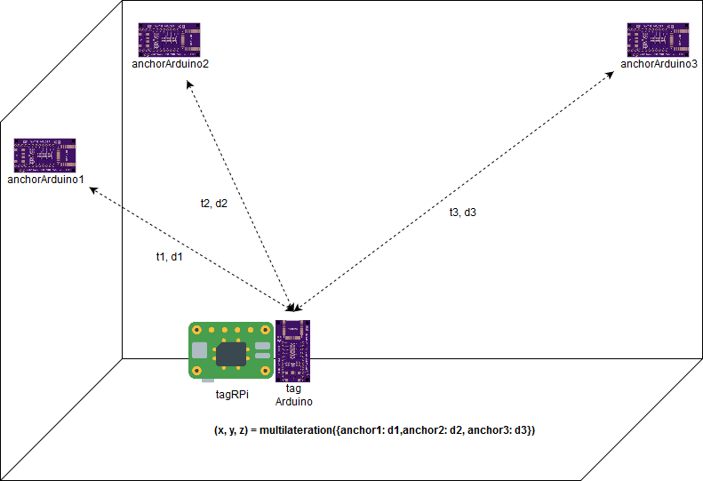

# ToA based positioning with DW1000 UWB module

## Overview

## Components

- `tagArduino/`: Arduino sketch for DW1000 tag
- `tagRPi/`: Raspberry Pi C++ app controlling `tagArduino`
- `anchorArduino/`: Arduino sketch for DW1000 anchor
- `headers/`: Common header files are located here

You can ignore other files

## Instructions

Navigate and find `README.md` in each directory of:

- [tagArduino](tagArduino)
- [tagRPi](tagRPi)
- [anchorArduino](anchorArduino)
