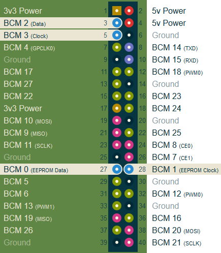

# tagRPi

## Installation

### Prerequisite

- Enable I2C on Raspberry Pi
- Install `libi2c-dev`, `libeigen3-dev`
- Download `mlat`

```sh
[sudo] raspi-config
# Enable I2C in Interfacing option
[sudo] apt-get install libi2c-dev libeigen3-dev
git clone https://github.com/gsongsong/mlat

```

### Building `tagRPi`

- Copy or symlink `def.h`, `i2c.h` from `headers` directory to here
- Edit `I2CSLAVEADDR` in `i2c.h` if needed
- Edit `MLAT` in `Makefile` properly
- Edit `I2CDEV` in `i2cController.h` properly
- Build `tagRPi`

```sh
make
```

### Wiring



Match and connect `SDA` and `SCL`

### Running `tagRPi`

- Edit `anchors.csv`
   - Format: `anchor ID, x, y, z (newline)`  
   Example

```
1, 0, 0, 0
2, 3.3, 3.3, 3.3
3, 6, 9, 3.3
```

- Run `tagRPi`

```sh
./tagRPi
```

## State Diagram


